# Projet Kubernetes - Déploiement des application de IC Group
 
## Objectif

Ce projet a pour objectifs de  conteneuriser, configurer et déployer les applications du IC Group dans un cluster Kubernetes tout en assurant la persistance des données des différentes ressources.  
- Odoo 13.0 : ERP open source  
- pgAdmin 4 : Interface Web d'administration pour PostgreSQL  
- Application web développer avec Flask permettant l'accès aux deux services ci-dessus.  
  
Source :  [Github repository](https://github.com/OlivierKouokam/mini-projet-5esgi)   

---
 
## Prérequis
 
- Cluster Kube
- Docker 
- Docker Hub
- Github 

 
---

# Mise en place

- 3 conteneur Kubernetes au sein du namespace icgroup : 
PostgreSQL
Odoo port 30090  
PgAdmin port 30091
  
## Copy du GIT
 
```bash
git clone https://github.com/qahtan7/kubeprojet-esgi.git
cd ic-webapp
```

# Mise en place de l'application avec Docker 

## Dockerfile

```bash
# Image de base
FROM python:3.6-alpine

# Définit le répertoire de travail
WORKDIR /opt

# Copie les fichiers de l’application dans l’image
COPY . .

# Installe Flask version 1.1.2
RUN pip install flask==1.1.2

# Expose le port 8080
EXPOSE 8080

# Définit les variables d’environnement
ENV ODOO_URL="https://www.odoo.com"
ENV PGADMIN_URL="https://www.pgadmin.org"

# Lance l’application
ENTRYPOINT ["python", "app.py"]
```

## Test 

Build 
```bash
docker build -t ic-webapp:1.0
```
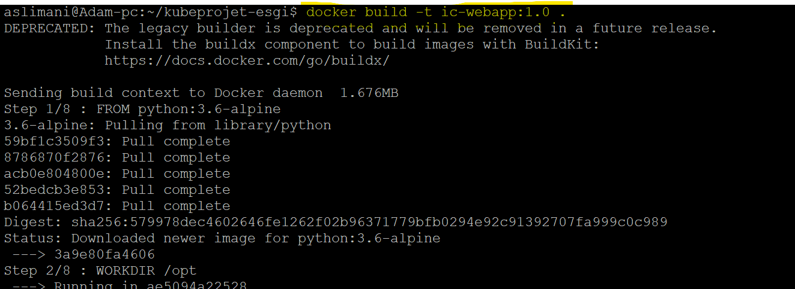

Check Image
```bash
docker image ls
```
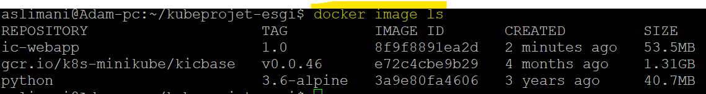

Launch App
```bash
docker run -d --name test-ic-webapp -p 8080:8080 -e ODOO_URL="https://www.odoo.com" -e PGADMIN_URL="https://www.pgmain.org" ic-webapp:1.0
```
Check
```bash
docker ps -a
```
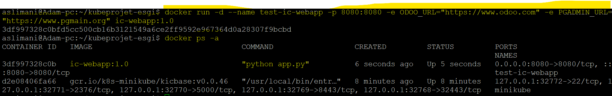

Test Web Interface

```bash
http://192.177.10.140:8080
```
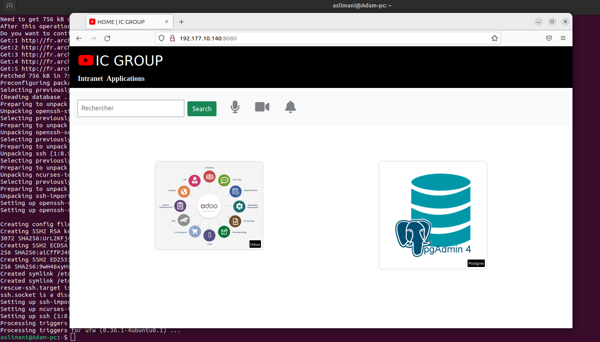

ODOO
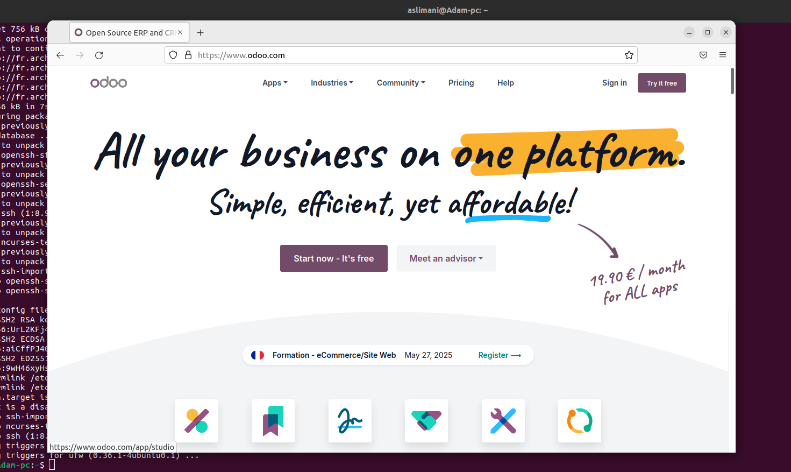

Creation d'un tag et push sur notre compte DokcerHub

```bash
docker login
docker tag ic-webapp:1.0 aslimani94470/ic-webapp:1.0
docker push aslimani94470/ic-webapp:1.0
```

Check DockerHub 
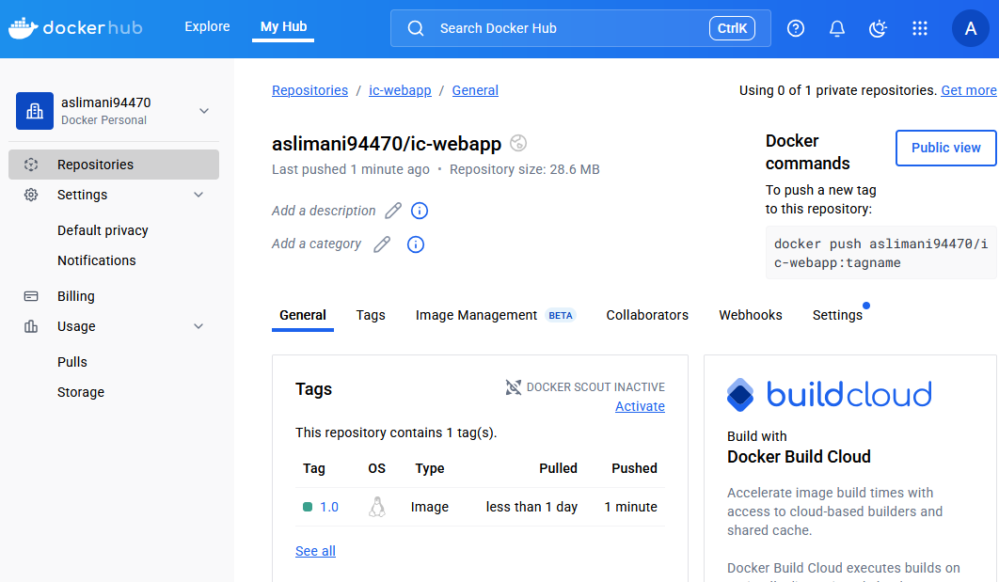

Docker stop & remove 
```bash
docker stop <container id>
docker rm <container id>
```
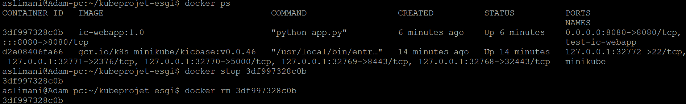

## Deploiement WebAPP

Namespace et Deploiement WebAPP

```bash
kubectl create ns icgroup 
kubectl apply -f ic-webapp-deployment.yaml -n icgroup  
kubectl apply -f ic-webapp-service.yaml -n icgroup  
```
## Deploiement de la Base de données

```bash
kubectl apply -f postgresql.yaml -n icgroup  
```
Creation de l'utilisateur odoo dans la base de donnée 

```bash
kubectl exec -it <pod name> -n icgroup -- bash
psql -U postgres
CREATE USER odoo WITH PASSWORD odoo;  
ALTER USER odoo CREATEDB;
```
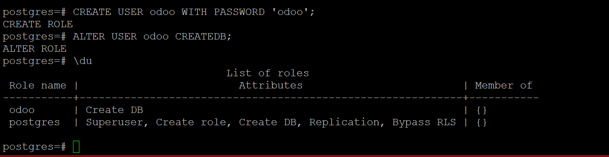

## Deploiement de Odoo
```bash
kubectl apply -f odoo.yaml -n icgroup  
```
## Deploiement de pgAdmin
```bash
kubectl apply -f pgadmin.yaml -n icgroup  
```
## Check ALL

```bash
kubectl get all -n icgroup  
```
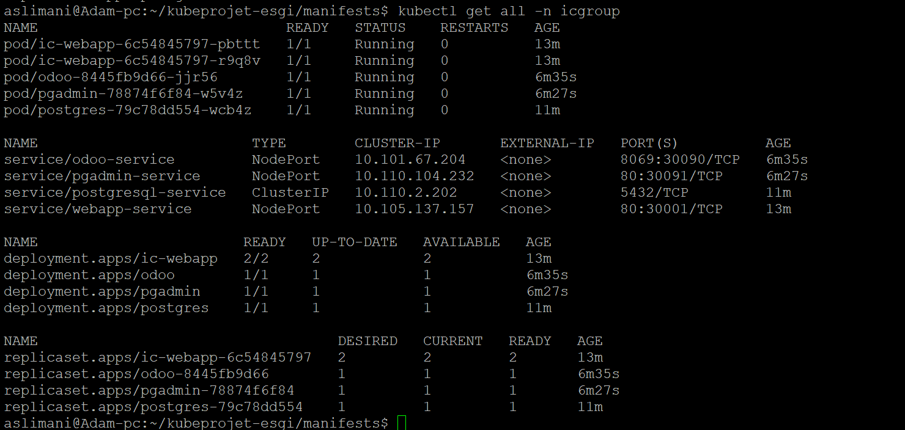 
Manifest 

```bash
kubectl get cm -n icgroup  
```
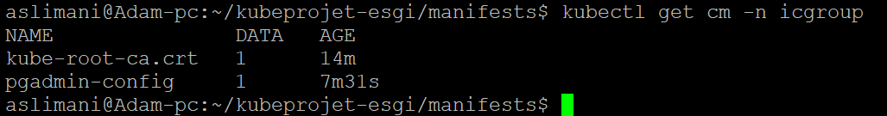 
ConfigMap  

```bash
kubectl get pvc -n icgroup  
```
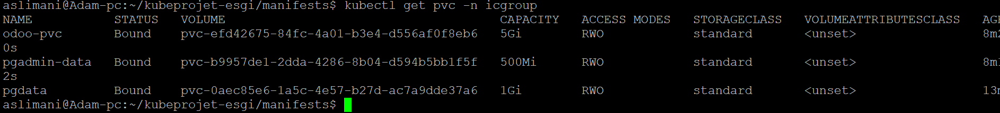 
Volume

## Check GUI 

Check Odoo 

```bash
http://192.177.10.140:30090 
```
Odoo Web interface OK

Création de la base de donnée ODOO
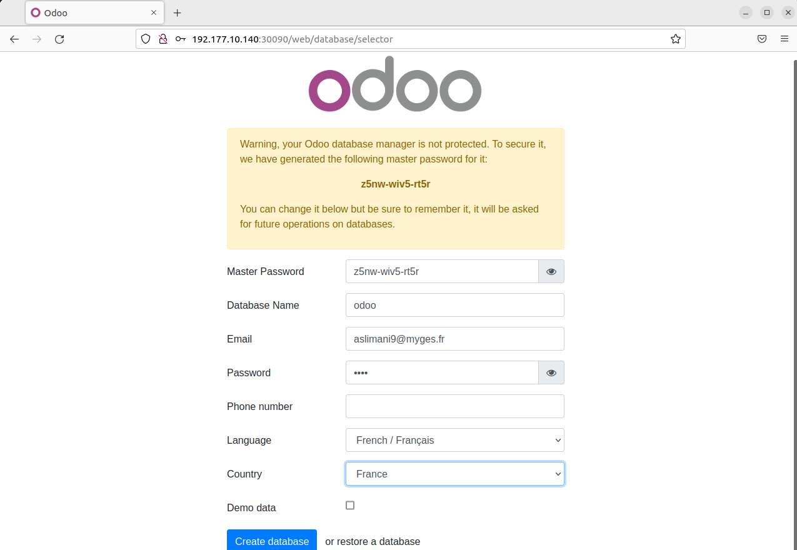 

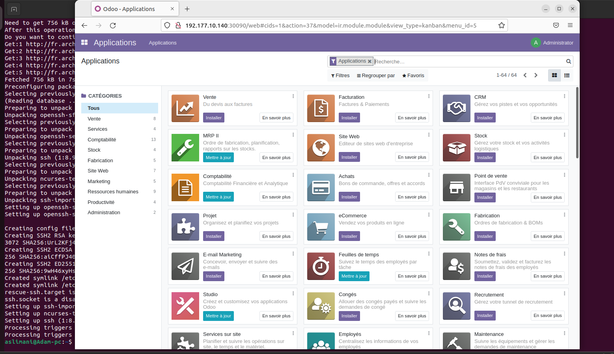 


PGAdmin Web interface OK 

```bash
http://192.177.10.140:30091 
```
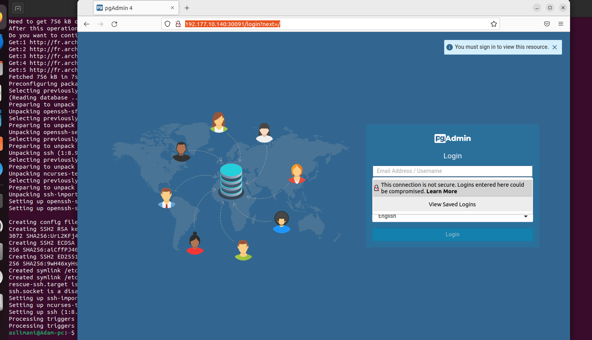 
PGAdmin Web interface OK

BDD Connection
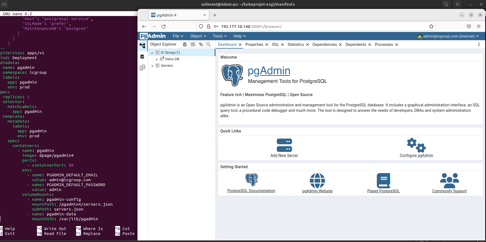

Connection avec l'utilisateur ODOO
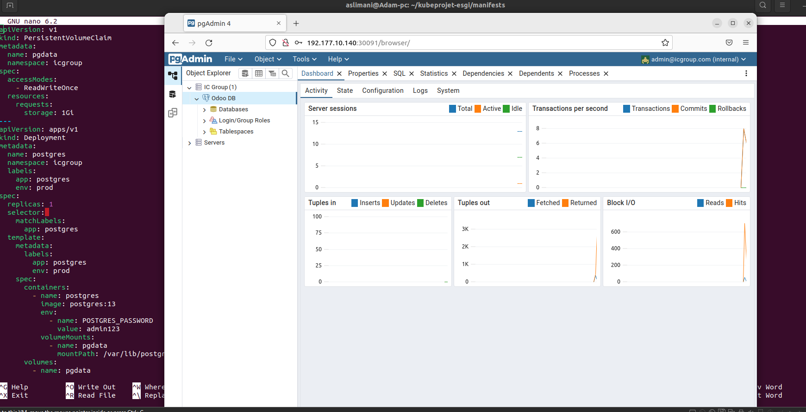   
OK

Odoo Web interface
```bash
http://192.177.10.140:30001  
```
Access Web interface port 30001 :
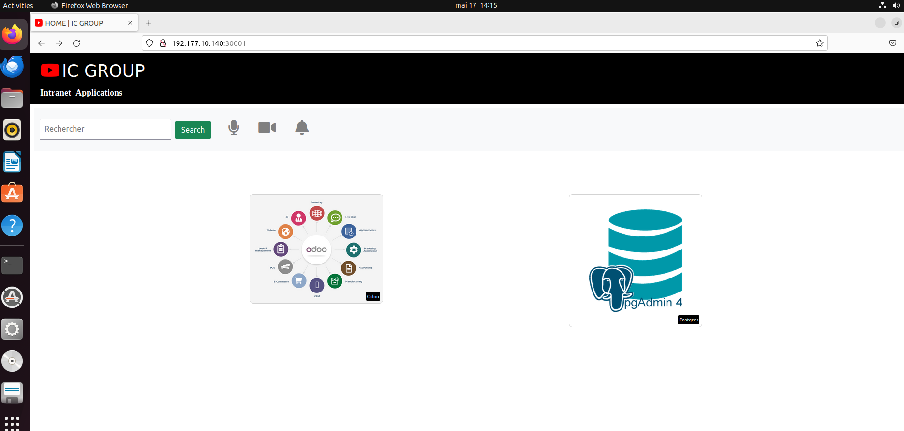  


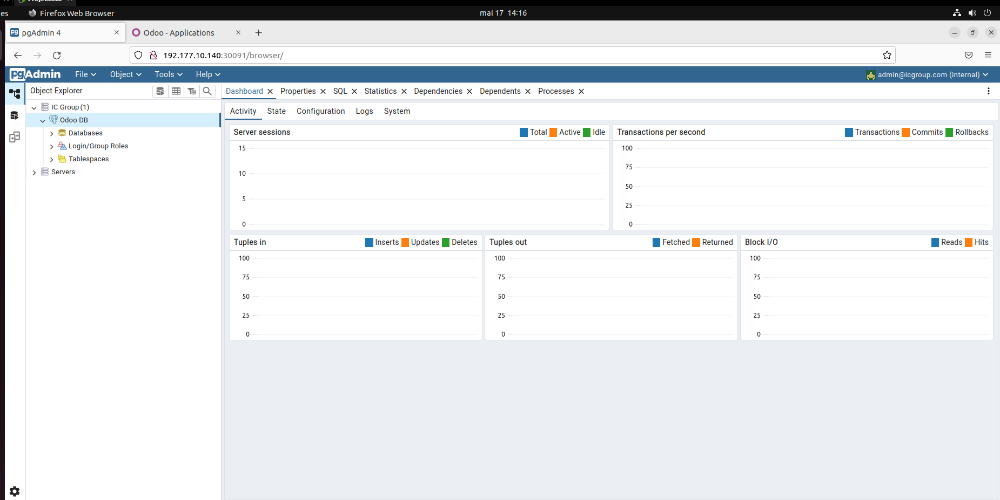  

Good Job, c'est terminé !  


